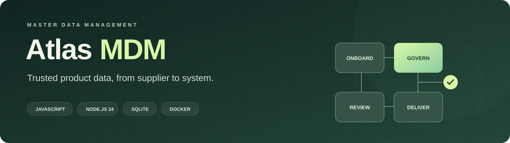
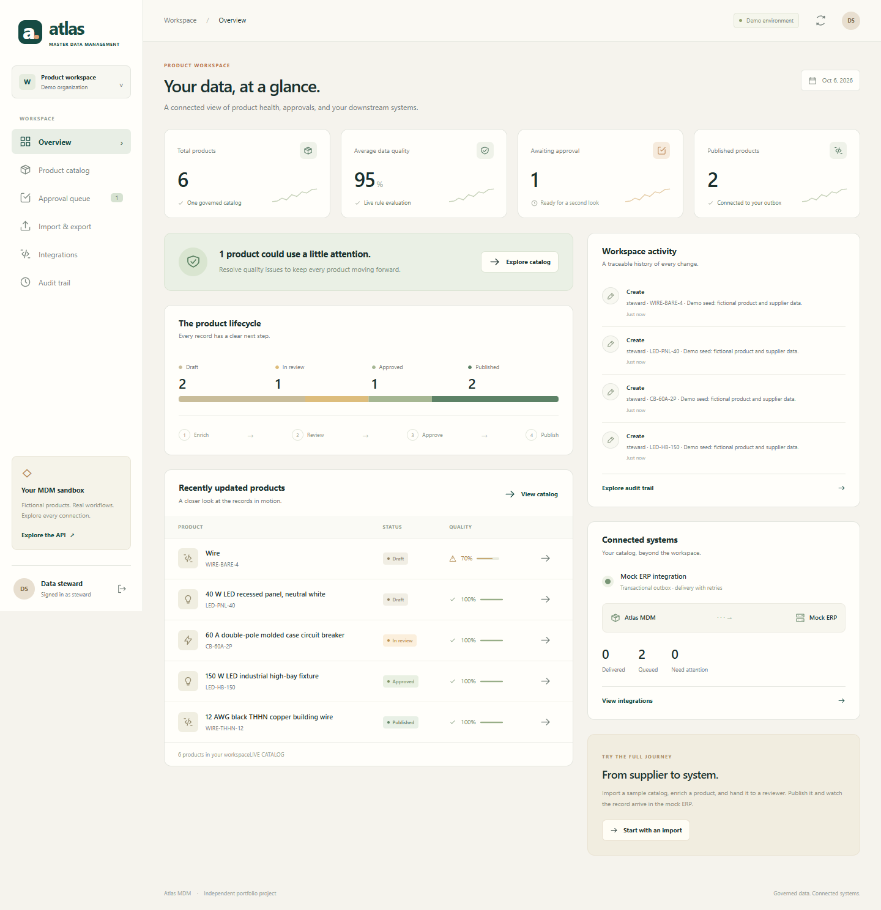
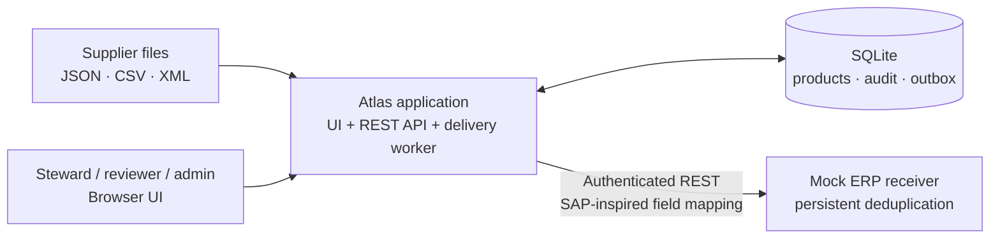
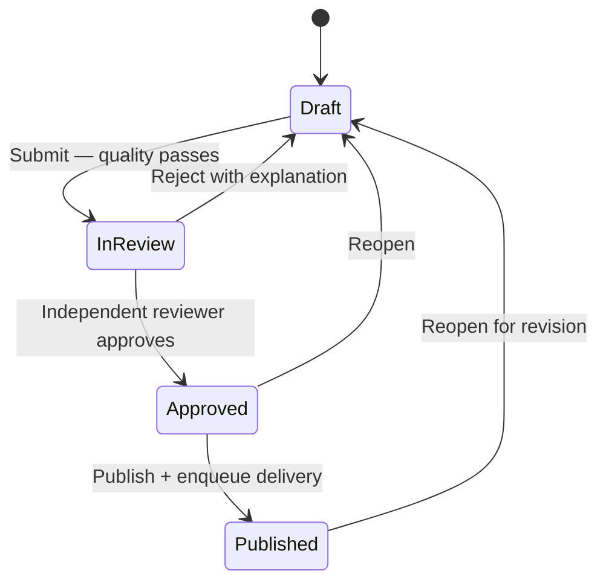

<p align="center">
  
</p>

<p align="center">
  <strong>A runnable master data management portfolio project for electrical distribution.</strong><br>
  JavaScript · Node.js 24 · SQLite · REST · Docker
</p>

<p align="center">
  <a href="https://github.com/Clayton-Klemm/atlas-mdm/actions/workflows/ci.yml"></a>
</p>

<p align="center">
  <a href="#run-with-docker">Run it</a> ·
  <a href="docs/demo-walkthrough.md">Demo walkthrough</a> ·
  <a href="docs/requirements.md">Role alignment</a> ·
  <a href="docs/architecture.md">Architecture</a> ·
  <a href="docs/runbook.md">Operations</a>
</p>

## What this demonstrates

Atlas turns supplier files into governed product records, checks quality, requires independent approval, and delivers published data to a simulated ERP. Open the browser to follow the same record through every stage.



*The working application with its fictional starter catalog. [Follow a record from supplier to ERP](docs/demo-walkthrough.md).*

| Capability | Inspect it |
| --- | --- |
| Product model, supplier references, category rules and quality feedback | Catalog and dashboard |
| JSON, CSV and XML onboarding with preview and atomic import | Imports; [sample files](samples/) |
| Steward/reviewer roles, revision conflicts and approval separation | Catalog and approval queue |
| REST integration, durable delivery jobs, retries and deduplication | Integrations; [API specification](docs/openapi.json) |
| Audit history, health checks and recovery procedures | Audit; [runbook](docs/runbook.md) |
| Automated checks and reviewable change practices | [Tests](test/), [CI](.github/workflows/), [change control](docs/change-control.md) |

This is an independent demonstration with fictional products, suppliers and users. It is not a licensed Stibo STEP instance, an SAP system, a certified connector, or an employer-sponsored project. It demonstrates relevant engineering skills; it does not establish a degree, years of experience, or production platform experience. [See the evidence and limits](docs/requirements.md).

## Run with Docker

Install Docker Desktop with Docker Compose, then clone and start:

```sh
git clone https://github.com/Clayton-Klemm/atlas-mdm.git
cd atlas-mdm
docker compose up --build -d
```

Open **[http://localhost:8080](http://localhost:8080)** after the app becomes healthy. The first run builds the containers and seeds the demo database; subsequent runs preserve your data.

| Username | Role | Shared demo password |
| --- | --- | --- |
| `steward` | Create, import, edit and submit | `AtlasDemo!2026` |
| `reviewer` | Review, reject, approve and publish | `AtlasDemo!2026` |
| `admin` | Operations and delivery recovery | `AtlasDemo!2026` |

These published credentials are for the local demo. Keep this deployment on your own computer. [Security scope](docs/security.md).

```sh
docker compose ps
docker compose logs --tail=100 app
docker compose down
```

`down` stops the demo and keeps its named data volumes. `docker compose down -v` removes those volumes and resets **all demo data**. [Troubleshooting and backup](docs/runbook.md).

### Without Docker

Install **Node.js 24.11.0 or newer within the 24.x line**, then run:

```sh
npm ci
npm run dev
```

Open [http://localhost:8080](http://localhost:8080). The development command starts the application and mock ERP; SQLite files are stored under `data/`. Stop with Ctrl+C. Docker is the recommended reproducible demo environment.

## Try the complete flow

1. Sign in as `steward`. Open Product catalog, inspect a Draft with quality issues and correct it.
2. Preview a sample supplier file under Import & export, then import it. A preview writes nothing.
3. Submit a complete Draft for review. Missing required data blocks submission.
4. Sign in as `reviewer`, approve the record, then publish it.
5. Open Integrations. Watch its durable job reach Delivered and inspect the mapped ERP material.
6. Open Audit trail to see who changed the record, its before/after data and each transition.
7. As `admin`, inject a temporary ERP failure before another publication and inspect recovery.

The [guided walkthrough](docs/demo-walkthrough.md) includes rejection, duplicate import, role separation and delivery recovery examples.

## How it fits together





Publication means the governed record is eligible for export and has a delivery job. The separate job status tells you whether the downstream system has acknowledged it. [Transaction boundaries and failure handling](docs/architecture.md).

## Verify and explore

```sh
npm ci
npm test
npm run check
```

Tests exercise business rules, workflow, imports, access controls and integration behavior. After running the app at least once, `npm run verify:backup` restores a separate database and checks its integrity. For Docker-only use, run `docker compose run --rm app npm run verify:backup`. Consult the CI run for the specific commit you are reviewing; this README does not substitute for test results.

For desktop and mobile browser checks:

```sh
npx playwright install chromium
npm run test:ui
```

The browser checks start isolated in-memory services on ports 8092 and 8093. They cover role handoffs, publication, imports, quality feedback, stale edits, and mobile navigation.

| Read next | Purpose |
| --- | --- |
| [Requirements and evidence](docs/requirements.md) | Role fit, acceptance criteria and honest limits |
| [Architecture](docs/architecture.md) | Model, boundaries, workflow and integration design |
| [Runbook](docs/runbook.md) | Deployment, job triage, backup and restore |
| [Security](docs/security.md) | Implemented controls and production gaps |
| [Change control](docs/change-control.md) | Release checklist and an illustrative defect analysis |
| [Decisions](docs/decisions.md) | Tradeoffs, backlog and illustrative sprint planning |
| [Contributing](CONTRIBUTING.md) | Local checks and review expectations |
| [Validation record](docs/validation.md) | Observed test, browser, container and recovery results |

Designed around the engineering work described in the [Border States MDM IT Application Developer posting](https://careers.borderstates.com/job/Fargo-MDM-IT-Application-Developer-ND-58104/1432773600/), reviewed October 6, 2026. Platform concepts are discussed with links to official documentation in [the architecture notes](docs/architecture.md#relationship-to-step).

## License

[MIT](LICENSE). Third-party package licenses remain with their respective owners.
