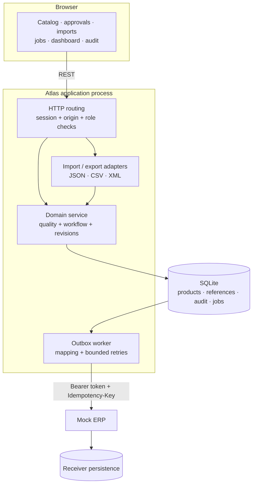
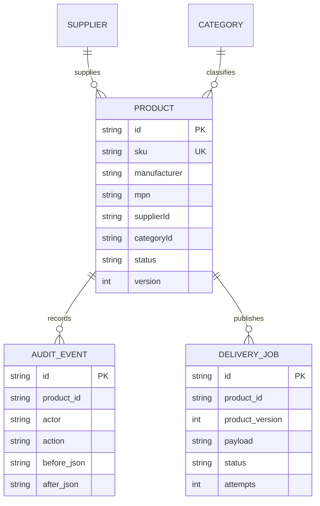
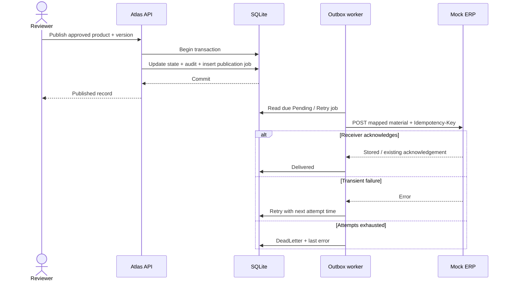

# Architecture

Atlas is a small product master data application with explicit business rules and recoverable downstream delivery. One Node.js 24 process serves the web interface, REST API and outbox worker. Another process simulates an ERP receiver. SQLite stores application state; the mock receiver persists its acknowledgements separately.

## Boundaries

The domain module does not depend on browser rendering or HTTP transport. Server authorization is authoritative. The UI communicates allowed actions and quality issues, while the domain enforces transitions for every caller.

## Product model

| Object | Purpose |
| --- | --- |
| Product | SKU, name, manufacturer, manufacturer part number, unit, electrical attributes, source, revision and lifecycle |
| Supplier | Controlled supplier reference, rather than a free-text identity |
| Category | Classification and category-specific data requirements |
| Audit event | Actor, action, before/after record, comment and time |
| Delivery job | Immutable publication payload, attempts, error and acknowledgement state |

This diagram shows logical relationships. Supplier/category IDs are checked by business rules rather than database foreign keys, so incomplete Drafts can temporarily carry missing or invalid references for remediation. Product links in audit/jobs are also logical. SKU and manufacturer/part-number identities are compared case-insensitively. Products retain source provenance. Updates require the current integer `version`; a stale version produces HTTP 409 rather than overwriting another user's work.

## Quality and governance

Drafts may be incomplete so that stewards can onboard imperfect supplier data. Quality evaluation reports individual field issues and a score. Submission, approval and publication are blocked until required rules pass. Rule examples include the SKU regular expression, unit-of-measure allowlist, valid references, required attributes, GTIN check digits and applicable electrical values.

| Action | State change | Authorized actor |
| --- | --- | --- |
| Submit | Draft → InReview | Steward or admin; quality passes |
| Approve | InReview → Approved | Reviewer or admin; neither creator nor last editor |
| Reject | InReview → Draft | Reviewer or admin; comment required |
| Publish | Approved → Published | Reviewer or admin |
| Reopen | Approved/Published → Draft | Steward or admin; clears approval |

Record edits are allowed in Draft only. Workflow actions and audit inserts share a transaction. SQLite triggers reject audit update/delete operations through the database interface, although an operator who controls the database file can alter it. This is operational history, not externally anchored tamper-proof evidence.

## Supplier adapters

JSON, CSV and XML adapters produce the same canonical input fields. A dry run parses and validates without committing. Import is bounded to 100 products and rejects a structurally invalid batch or duplicate identity in its entirety. Business-quality issues may still create Drafts for correction. The three [sample files](../samples/) contain the same fictional catalog so reviewers can compare the adapters.

Exports contain Published products only. The sample XML schema belongs to Atlas and does not claim to be STEPXML or a vendor interchange standard.

## Publication and ERP delivery

Publication commits a payload snapshot and job alongside the record and audit event. An outage cannot erase an already committed delivery intent. Retries resend that snapshot, not a later edited version. A unique product/version job key prevents duplicate enqueueing, and the receiver persists idempotency keys to deduplicate repeated delivery. This is **at-least-once delivery with receiver deduplication**, not a claim of exactly-once transport.

The SAP-inspired mapping includes `MATNR`, `MAKTX`, `MEINS`, `MATKL`, `MFRNR`, `MFRPN`, `VOLTAGE`, `GTIN` and `sourceVersion`. It is a documented demo REST contract, not an IDoc, BAPI or certified SAP interface. `Published` and `Delivered` are intentionally distinct states: governance approval can succeed while the downstream system is unavailable.

## Relationship to STEP

Stibo's documentation describes business rules evaluated for an object within a context and workspace, including conditions around approval and logic used in imports and workflows. Atlas applies a related pattern: a product is evaluated, a condition gates its transition, and an action records the result. This is a design analogy, not compatible STEP configuration. [Official business-rule documentation](https://doc.stibosystems.com/doc/version/10.2/web/content/busrules/using_business_rules_in_step.html).

STEP's System Setup documentation identifies attributes, controlled values, object types, references, users/groups, workflows, UI and integration configuration as platform components. Atlas exposes a smaller independent implementation through category/reference data, role policies, a browser UI and API adapters. It does not reproduce STEP's repository, Workbench, execution engine or deployment tooling. [Official System Setup documentation](https://service.stibosystems.com/documentation/step2025q1/content/getstart/wrkbnchui/system_setup_tab.html).

## Operating scope

The application supports a single local instance and one delivery worker. It has no distributed worker leases, clustered writes, SSO, tenant isolation or production monitoring service. SQLite and local volumes make the demo easy to inspect; [decision notes](decisions.md) describe what a larger deployment would require.
